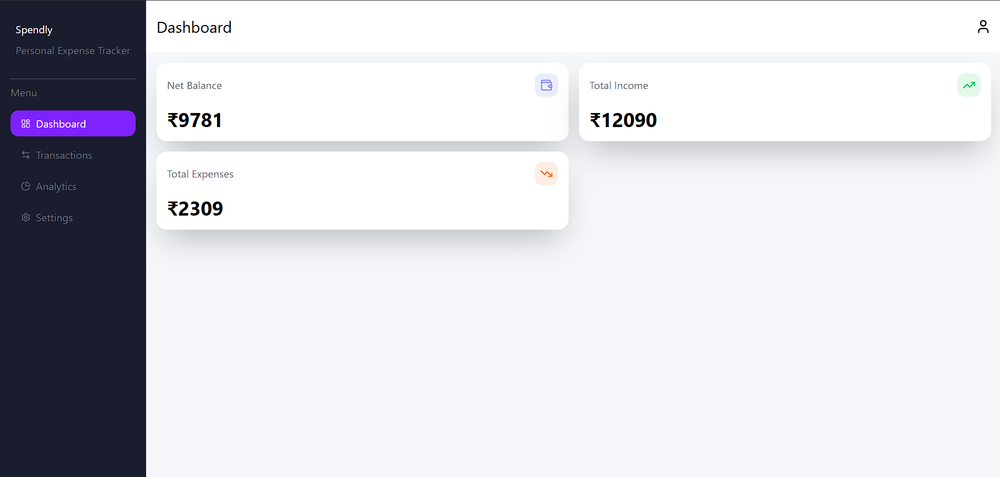
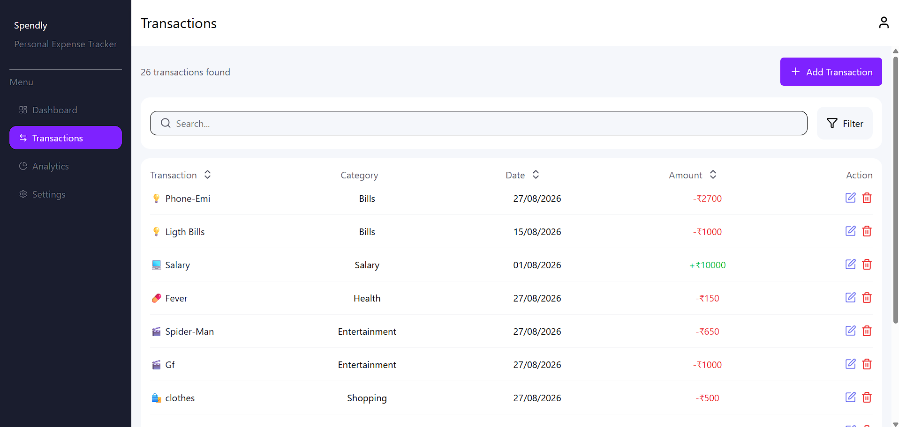
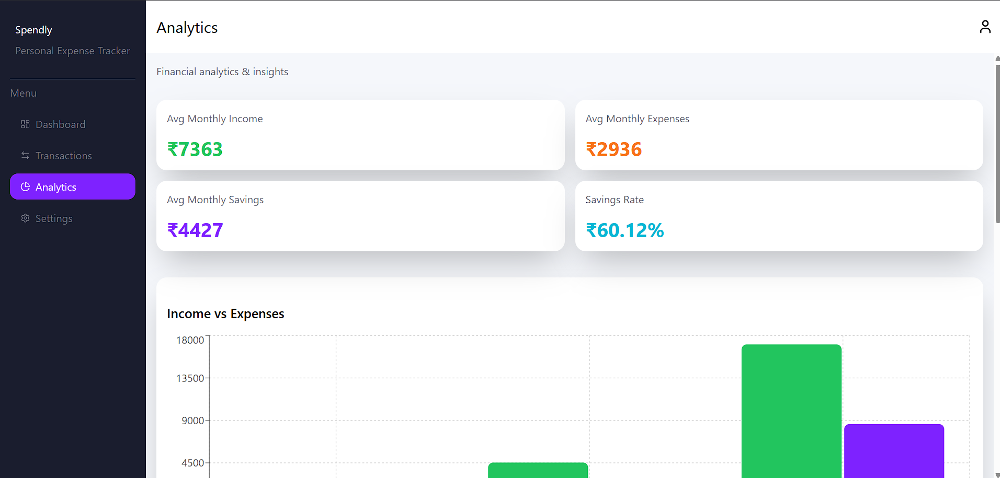
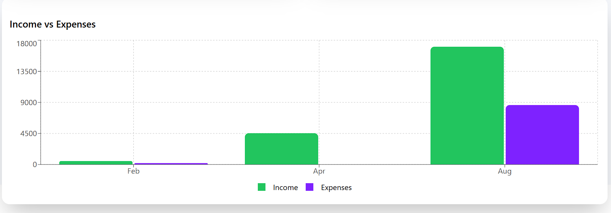
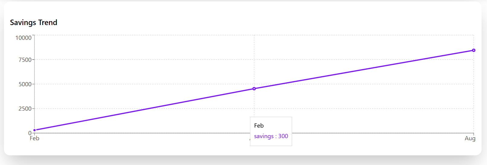
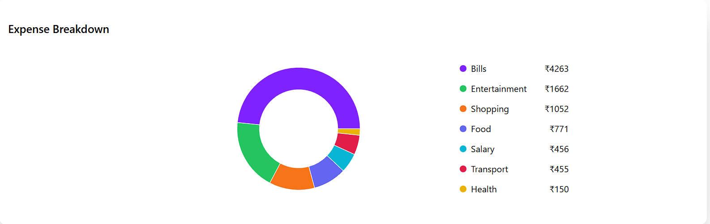
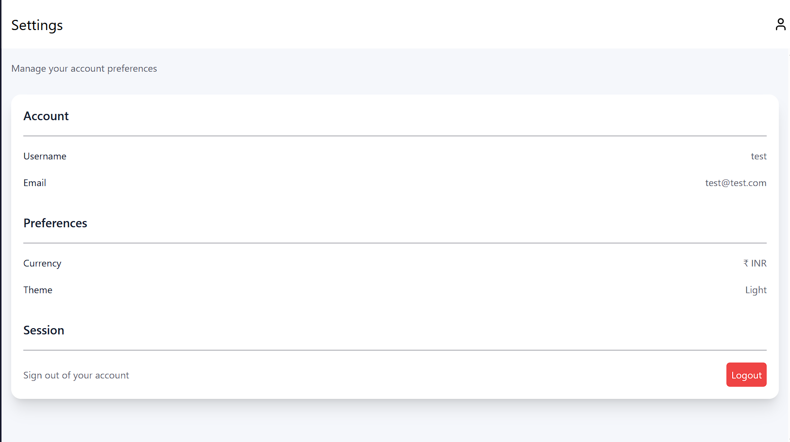
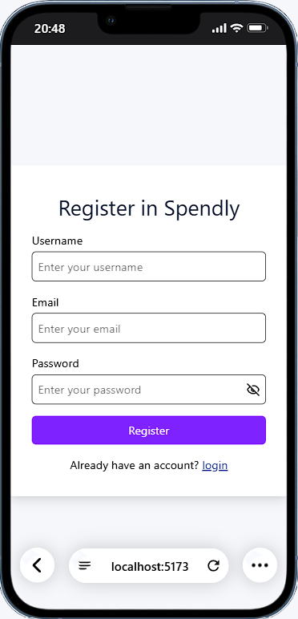
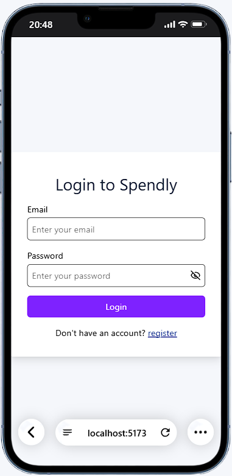

# Spendly

> A full-stack personal expense tracker for managing, tracking, and analyzing your income and expenses.

## ✨ Features

- 🔐 User authentication with login and registration
- 💰 Create, edit, and delete income and expense transactions
- 🔎 Search and filter transactions
- 📄 Paginated transaction list
- 📊 Dashboard with income, expenses, and net balance overview
- 📈 Financial analytics with income, expense, savings, and category breakdown charts
- ✅ Form validation for authentication and transaction forms
- 🔄 Loading states and skeleton loaders
- ⚠️ API error handling with retry functionality
- 🔔 Success and error notifications
- 📱 Responsive design for mobile, tablet, and desktop

# Tech Stack

## Frontend
- React
- React Router
- Tailwind CSS
- React Hook Form
- Axios
- Recharts
- React-Loading-Skeleton
- Sonner
- Lucide React

## Backend
- Node.js
- Express.js
- MongoDB

# Screenshots

## Dashboard



## Transactions



## Analytics









## Settings



## Mobile View






# Live Demo

[**Try Spendly →**](https://spendly-ten-sandy-25.vercel.app/)

# Project Structure

```text
Spendly/
│
├── frontend/
│   ├── public/
│   │   └── spendly-favicon.png
│   │
│   ├── src/
│   │   ├── components/
│   │   │   ├── layouts/
│   │   │   │   ├── MainLayout.jsx
│   │   │   │   ├── Navbar.jsx
│   │   │   │   └── Sidebar.jsx
│   │   │   │
│   │   │   └── Ui/
│   │   │       ├── skeletons/
│   │   │       │   ├── AnalyticsSkeleton.jsx
│   │   │       │   ├── SettingsSkeleton.jsx
│   │   │       │   └── TransactionsListSkeleton.jsx
│   │   │       ├── Button.jsx
│   │   │       ├── Card.jsx
│   │   │       ├── ErrorState.jsx
│   │   │       ├── FormInput.jsx
│   │   │       ├── Modal.jsx
│   │   │       ├── Pagination.jsx
│   │   │       └── PasswordInput.jsx
│   │   │
│   │   ├── context/
│   │   │   ├── AuthContext.jsx
│   │   │   └── TransactionsContext.jsx
│   │   │
│   │   ├── Guards/
│   │   │   └── ProtectedRoute.jsx
│   │   │
│   │   ├── hook/
│   │   │   ├── useAuth.js
│   │   │   └── useTransactions.js
│   │   │
│   │   ├── pages/
│   │   │   ├── Analytics.jsx
│   │   │   ├── Dashboard.jsx
│   │   │   ├── Login.jsx
│   │   │   ├── PageNotFound.jsx
│   │   │   ├── Register.jsx
│   │   │   ├── Settings.jsx
│   │   │   └── Transactions.jsx
│   │   │
│   │   ├── routes/
│   │   │   └── AppRoutes.jsx
│   │   │
│   │   ├── services/
│   │   │   ├── auth.service.js
│   │   │   ├── axios.js
│   │   │   └── transactions.service.js
│   │   │
│   │   ├── App.jsx
│   │   ├── index.css
│   │   └── main.jsx
│   │
│   ├── .gitignore
│   ├── index.html
│   ├── package.json
│   ├── vercel.json
│   └── vite.config.js
│
├── backend/
│   ├── config/
│   │   ├── cookieOptions.js
│   │   └── db.js
│   │
│   ├── controllers/
│   │   ├── authController.js
│   │   └── transactionController.js
│   │
│   ├── middlewares/
│   │   └── authMiddleware.js
│   │
│   ├── models/
│   │   ├── Transaction.js
│   │   └── User.js
│   │
│   ├── routes/
│   │   ├── authRoutes.js
│   │   └── transactionRoutes.js
│   │
│   ├── utils/
│   │   └── generateToken.js
│   │
│   ├── .env.example
│   ├── .gitignore
│   ├── package.json
│   └── server.js
│
└── README.md

```

# Getting Started

## 1. Clone the repository

Follow the steps below to run Spendly locally.

1. Clone the repository

```bash

git clone https://github.com/Samad0777/Spendly.git

cd Spendly


2. Setup the Backend

cd backend

npm install

npm run dev


3. Setup the Frontend

Open a new terminal:

cd frontend
npm install
npm run dev
```


## 🔐 Environment Variables

Spendly requires environment variables for the frontend and backend configuration.

### Backend

Create a `.env` file inside the `backend` directory:

```env
PORT=your_port
MONGO_URI=your_mongodb_connection_string
JWT_SECRET=your_jwt_secret
CLIENT_URL=your_frontend_url
NODE_ENV=development/production
```

### Frontend

Create a `.env` file inside the `frontend` directory:

```env
VITE_API_BASE_URL=backendurl/api
```


# Api / Backend

Spendly uses a separate REST API backend built with Node.js and Express.js.

The backend is responsible for:

- User registration and authentication
- User session management
- Creating transactions
- Updating transactions
- Deleting transactions
- Fetching transactions with search, filtering, and pagination
- Dashboard summary data
- Monthly financial analytics
- Category-wise expense breakdown

The frontend communicates with the backend through Axios-based service modules.

Authentication uses HTTP-only cookies.

# Key Implementation Details

- Reusable Components: Common UI elements such as buttons, form inputs, cards, modals, pagination, error states, and loading components are built as reusable components.

- Form Handling & Validation: React Hook Form is used for handling authentication and transaction forms with client-side validation.

- API Integration: API requests are organized into dedicated service modules using Axios.

- State Management: React Context API is used to manage authentication and transaction-related application state.

- Protected Routes: Authenticated pages are protected using a dedicated ProtectedRoute component.

- Loading States: Skeleton loaders and loading states are implemented for API-driven pages and actions.

- Error Handling: API errors are handled with user-friendly error states, retry functionality, and toast/inline feedback where appropriate.

- Responsive UI: The interface is designed to work across mobile, tablet, and desktop screen sizes using Tailwind CSS.

- Data Visualization: Recharts is used to visualize income, expenses, savings trends, and category breakdowns.

- Pagination & Filtering: Transaction data supports pagination, search, transaction type filtering, and category filtering.


# Future Improvements

- Add TypeScript support

- Add automated testing

- Improve authentication and session handling across different deployment environments

- Add more advanced financial insights and reporting

- Add transaction export functionality

- Improve accessibility across the application

# Author

Sheik Fardeen

GitHub: [@Samad0777](https://github.com/Samad0777)